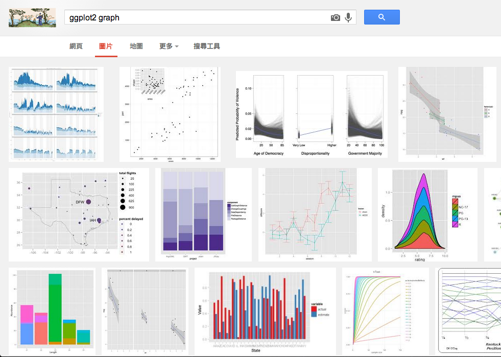
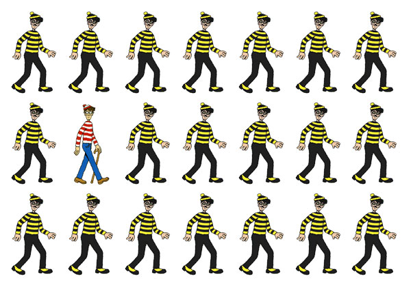

```{r setup, include=FALSE}
knitr::opts_chunk$set(warning = TRUE,
                      echo = TRUE,
                      message = FALSE,
                      collapse = FALSE,
                      comment = "#>",
                      fig.align='center',
                      cache=TRUE)
library(magrittr)
library(readr)
library(dplyr)
library(tidyr)
library(ggplot2)
library(ggrepel)  # text labeling
library(cowplot); theme_set(theme_grey()) 
library(ggplot2movies) # IMDB movie data
```

## How to use this slides

The following single character keyboard shortcuts enable alternate display modes:

- 'f' enable fullscreen mode
- 'w' toggle widescreen mode
- 'o' enable overview mode

### Download the slides

[Here](http://leoluyi.github.io/RViz_201609/)
(Right Click > Save As...)

##  

<div align="center" style="font-size: 200%">
<p>課程資訊</p>
<a target="_blank" href="http://data-sci.info/">網站</a>/
<a target="_blank" href="https://www.facebook.com/datasci.info">粉絲頁</a>/
<a target="_blank" href="https://github.com/datasci-info/TCA_R_Viz/issues">論壇</a>/
<a target="_blank" href="https://goo.gl/CX1yya">廣播</a>/
<a target="_blank" href="https://goo.gl/B3JFBu">共筆</a>
</div>

<div align="center">
<h3>
課後若有任何問題歡迎至論壇發問
</h3>
</div>


## 大家的一些課前問題

- 對於（資料）視覺化想得太簡單或太難
- 覺得視覺化需要天生的設計美感？
- 好的視覺化是不是主觀的？
- 想實做自己的視覺化流程，但不知道如何開展，老是做到一半放棄
- 用 Excel 辛苦做出的圖表，卻無法在下次重複使用
- 導入視覺化工具，卻變成「純試試」，一點都不實用，造成導入的軟體無法發揮其效用

## {.flexbox .vcenter .emphasized}

為什麼需要視覺化？

## 關於資料視覺化

+ 發現故事
+ 說服
  - 展示資料
  - 展示資料背後的故事
+ 做決策

## EDA Process (Exploratory Data Analysis) {.flexbox .vcenter}


## To Communicate {.flexbox .vcenter}

<a href="http://r4ds.had.co.nz/communicate-intro.html" target="_blank">

</a>


## 1854 年霍亂

John Snow 繪製了英國倫敦蘇活區的霍亂地圖，比對發現某一水井和感染者的居住地點相近，終於將汙染源鎖定在該水井，一周之後，市政府就封了這口水井，後來也證明霍亂是由汙水傳染而非一般認定的空氣傳染。


<div class="footer">
http://blog.rtwilson.com/john-snows-cholera-data-in-more-formats/
</div>

## 我們沒有太多偉大的目標

- 報告給老闆、同事......
- 讓相關的人做決策

> "The simple graph has brought more information to the data analyst's mind than any other device." -- John Tukey


## {.flexbox .vcenter .emphasized}

資料視覺化，重點在「<underline>資料</underline>」

## 資料視覺化思考範例：Anscombe's Quartet

經典資料集：Anscombe's Quartet

- 4 x-y datasets
- 相同的平均數和變異數 ── <underline>從數字上完全看不出差異</underline>
- 用甚麼方式可以看到差異？

```{r, echo=FALSE}
psych::describe(anscombe)
knitr::kable(anscombe)
```

## 資料視覺化思考範例：Anscombe's Quartet

- 圖表可看到原本看不到的東西

```{r, echo=FALSE}
library(tidyr)
anscombe_df <- anscombe %>%
  tbl_df %>%
  gather() %>%
  extract(key, c("xy", "dataset"), "([xy])(\\d)") %>%
  group_by(dataset, xy) %>%
  mutate(row = 1:n()) %>%
  spread(key = xy, value = value)

ggplot(anscombe_df, aes(x = x, y = y)) +
  geom_point(color = "black") +
  facet_wrap(~ dataset, ncol = 2) +
  geom_smooth(formula = y ~ x,
              method = "lm", se = FALSE)
```


## 視覺化之所以會讓人覺得很難

是因為我們想要學會光譜的每一段，但事實上只要根據<underline>目的</underline>去學


<div class="footer">
http://www.excelcharts.com/blog/infographics-data-visualization/
</div>

## Tukey

- Box Plot

<a href="https://en.wikipedia.org/wiki/Box_plot">

</a>

## Stephen Few

- Dashboard

<a href="https://www.perceptualedge.com/blog/?p=1374">

</a>

## More Infographics and Design {.smaller}

- [THE 100 BEST INFOGRAPHICS OF THE LAST DECADE](https://www.visualnews.com/2016/04/18/100-best-infographics-last-decade/)

<div align="center">
<a href="http://gotemcoach.com/post/37341676540/kobes-30k-infographic-detailing-kobe-bryants">

</a>
</div>

## {.flexbox .vcenter .emphasized}

要選擇什麼工具作圖？

## 要選擇什麼工具作圖

1. 這張圖多重要？
2. 可以花多少時間？值得花這麼多時間嗎？
3. 有必要這要畫嗎？
4. 這樣畫想要呈現什麼？

## 圖表也有分好壞

> - 評斷的標準是什麼？
> - 根據不同的理論可以擷取出上百種原則
> - 所以我們要掌握一些心法，讓我們選擇圖表時更簡單、專注

## {.flexbox .vcenter .emphasized}

希望上完課後<br/>大家都能把這個能力帶回去


# ggplot2 in R 與繪圖心法

## ggplot2 簡介

- [`ggplot2`](http://ggplot2.org) 是一個很強大的資料探索及視覺化工具，
是許多最有影響力的 R 套件開發者 [Hadley Wickham](http://had.co.nz) 所開發
- 所有繪圖函數都有背後的視覺化邏輯（[Grammar of Graphics](http://www.amazon.com/The-Grammar-Graphics-Statistics-Computing/dp/0387245448)）

__Grammar of Graphics__ 的作用就是幫助我們將圖表拆解成<underline>個別元素</underline>，
然後將這些元素按照邏輯個別操作，<underline>***正確***又***簡單***</underline>地達到圖表的目的

## {.flexbox .vcenter}

It is far better to learn a language by actually speaking it!

## 一個例子學會畫圖：mpg 🚗油耗資料

`mpg` dataset:  
Fuel economy data from 1999 and 2008 for 38 popular models of car.

| variable     | detail                                               |
|--------------|------------------------------------------------------|
| manufacturer | 車廠                                                 |
| model        | 型號                                                 |
| displ        | 引擎排氣量                                           |
| year         | 出廠年份                                             |
| cyl          | 氣缸數                                               |
| trans        | 自／手排                                             |
| drv          | f = front-wheel drive, r = rear wheel drive, 4 = 4wd |
| cty          | city miles per gallon 城市駕駛油耗                   |
| hwy          | highway miles per gallon 高速公路駕駛油耗            |
| fl           | 汽油: ethanol E85, diesel, regular, premium, CNG     |
| class        | 車型                                                 |

## 用圖表回答問題

- 大引擎的車子更耗油嗎？如果是的話，那有多耗油？
- 引擎大小和油耗效率之間的關係為何？正/負相關？線性/非線性？相關程度？

## 如果你給你老闆看這種表格


## 一個例子學會畫圖：mpg

先看兩個變數：

1. displ - 引擎排氣公升
2. hwy - (油耗效率，哩/加侖)


## Scatterplots

```{r}
library(ggplot2)
ggplot(data = mpg) +
  geom_point(mapping = aes(x = displ, y = hwy))
```

##

從圖表可歸納幾個結論：

1. 兩變數為高度負相關 ── 大引擎 => 低效率
2. 有些車是離群值


```{r, eval=FALSE, include=FALSE}
ggplot(data = mpg, mapping = aes(x = displ, y = hwy)) +
  geom_point() +
  geom_point(data = dplyr::filter(mpg, displ > 5, hwy > 20), colour = "red", size = 2.2)
```


## Exercise: 用 `mpg` 資料畫不同的圖

看看不同變數之間的相關

- 畫出 scatterplot: `hwy` vs `cyl`
- 畫出 scatterplot: `class` vs `drv`

## Answer-1

```{r, message=FALSE}
## hwy vs cyl
ggplot(data = mpg) +
  geom_point(mapping = aes(x = hwy, y = cyl))
```

## Answer-2

```{r, message=FALSE}
## class vs drv
ggplot(data = mpg) +
  geom_point(mapping = aes(x = class, y = drv))
```

# Aesthetic Mapping

## Aesthetic Mapping

- 在 **Grammar of Graphics** 裡面最重要的概念就是 **<underline>Aesthetic Mapping</underline>**
- 在畫圖前我們先來練習用眼睛👀看 **aethetics**

## Exercise: 觀察 Aesthetic Mapping

- 有哪些變數 variables
- 分別對應到哪個 aethetic

## Aesthetics 基本題 1

>- x = displ
>- y = hwy
>- color = class

```{r, echo=FALSE}
ggplot(data = mpg) +
  geom_point(mapping = aes(x = displ, y = hwy, color = class), size = 3)
```

## Aesthetic Mappings

在 x-y 二維的 Scatterplot 加入第三個 aesthetic

- 把 class 對應到點的**顏色**
- hint: `?geom_point`: 查詢支援的 aesthetics


## Aesthetic Mappings

- x = displ
- y = hwy
- color = class

```{r}
ggplot(data = mpg) +
  geom_point(mapping = aes(x = displ, y = hwy, color = class))
```


## Aesthetics 基本題 2

>- x = displ
>- y = hwy
>- alpha (透明度) = class

```{r, echo=FALSE}
ggplot(data = mpg) +
  geom_point(mapping = aes(x = displ, y = hwy, alpha = class), size = 3)
```


## Exercise

試試在 x-y 二維的 Scatterplot 加入第三個 aesthetic

- 把 class 對應到點的**alpha (透明度) **
- hint: `?geom_point`: 查詢支援的 aesthetics

## Answer

```{r}
ggplot(data = mpg) +
  geom_point(mapping = aes(x = displ, y = hwy, alpha = class))
```


## Aesthetics 基本題 3

>- x = displ
>- y = hwy
>- shape = class

```{r, echo=FALSE, message=FALSE, warning=FALSE}
ggplot(data = mpg) +
  geom_point(mapping = aes(x = displ, y = hwy, shape = class))
```


## Exercise

試試在 x-y 二維的 Scatterplot 加入第三個 aesthetic

- 把 class 對應到點的**形狀**

## Answer

```{r}
ggplot(data = mpg) +
  geom_point(mapping = aes(x = displ, y = hwy, shape = class))
```


## Aesthetic Mappings

```{r, eval=FALSE}
ggplot(data = <DATA>) + # Data
  geom_<xxx>(
     mapping = aes(<MAPPINGS>), ##  <= Aesthetic mappings
     stat = <STAT>,
     position = <POSITION>
  ) +
  scale_<xxx>() + coord_<xxx>() + facet_<xxx>()
  theme_()
```

- `aes()` 可以放在：
    - `ggplot()`裡面 -- **有**<underline>"記憶效果"</underline>(成為所有圖層預設帶入)
    - 外面 `+ aes()` -- **有**<underline>"記憶效果"</underline>(成為所有圖層預設帶入)
    - `geom_<xxx>()`裡面 -- **無**"記憶效果"(只對該 geom 有效)
- `geom_<xxx>(inherit.aes=FALSE)`: overrides the default aesthetics.


## Static Aesthetic

有時候你可能只想要手動設定某個<underline>固定 aesthetic</underline>，這個例子的設定只為了美觀，
並不會帶出多餘資料訊息。

- 將 aesthetic 放在 aes() 裡面: map aesthetic 並自動建立 legend
- 將 aesthetic 放在 aes() 之外: 手動設定某個固定 aesthetic

```{r}
ggplot(data = mpg) +
  geom_point(mapping = aes(x = displ, y = hwy), color = "blue")
```


## Aesthetics: Perceptual Task {.flexbox .vcenter}


<div class="footer">
- https://www.geography.wisc.edu/faculty/roth/publications/Roth_2015_EG.pdf
- http://www.iag-aig.org/attach/30dee1f85f7bd479367f1f933d48b701/V61N1_2FT.pdf
- http://www.infovis-wiki.net/index.php?title=Visual_Variables
</div>

## Aesthetics 不只這些

如何查？

- `?geom_`: 各 **geom** 有不同支援的 aesthetics


<!-- ## Visual Variable Accuracy {.flexbox .vcenter} -->

<!-- <a href="http://moritz.stefaner.eu/resources/datavis/osna/2013/"> -->
<!--  -->
<!-- </a> -->

## Visual Variable Accuracy {.flexbox .vcenter}

<a href="https://joeparry.wordpress.com/2007/08/29/visual-variables/">

</a>

<span class="red">***Bar Chart*** may be the most useful type!!</span>

<div  class="footer">
- [MacKinlay (1986)](http://www2.parc.com/istl/projects/uir/publications/items/UIR-1986-02-Mackinlay-TOG-Automating.pdf)
<div>


## HW: 找圖觀察 Aesthetics

- 上網 [The Economist - Graphic detail](http://www.economist.com/blogs/graphicdetail) 找 2 張圖或自己手上有的圖，找出 variable 對應的 aesthetic
- 找出是否有多餘的對應（一個 variable 對多個 aesthetic）
    - <span class="red2">✘ 切忌畫蛇添足</span>

## Junk Colors

<!--  -->

```{r, echo=FALSE, fig.width=10, fig.height=4}
p1 <- ggplot(data = mpg) +
  geom_bar(mapping = aes(x = class, fill = class)) +
  guides(fill = FALSE) +
  ggtitle("Unnecessary Colors")
p2 <- ggplot(data = mpg) +
  geom_bar(mapping = aes(x = class)) +
  ggtitle("Better")
cowplot::plot_grid(p1, p2)
```

## 如何判斷好的圖表

一開始我們只要著重在圖表的資訊本身:

1. <underline>增加資訊</underline>
2. <underline>減少雜訊</underline>

## Data-Ink Mazimazation

1. 資訊在哪裡？
    - 跟<underline>資料本身</underline>相關的
    - 跟<underline>目的</underline>相關的

2. 雜訊在哪裡？
    - 其他一切不相關的都先當作雜訊


## 消去不需要的元素 {.flexbox .vcenter}


## (附錄) How Data-Ink Maximazation { .smaller }

1. 去除不必要的非資料物件
    - 去掉不必要的背景色彩
    - 去掉無意義的色彩變化
    - 淡化圖表格線
    - 去掉一切立體效果
2.  弱化和統一剩下的非資料物件
    - 使用淡色的：座標軸、格線、表格線、填滿色
3. 去除多於變數
    - 一個 `x-y 方格` 最多只留三個變數，一個畫面太多變數會影響資訊吸收
4. 強調最重要的資料點
    - 標色


## 中場休息 ♨️  {.flexbox .vcenter}

<a href="http://clterryart.tumblr.com/" target="_blank">

</a>

## There are two main plotting functions in `ggplot2`:

- `qplot()`: (quick plot) 需要快速畫圖時才使用，用法和 R 的內建繪圖函數 `plot()` 差不多
- `ggplot()`: <underline>推薦的繪圖方法</underline>，搭配繪圖步驟的其他函數逐步建構圖層

## ggplot2 起手式

```{r, eval=FALSE}
ggplot(data = <DATA>) + # Data
  geom_<xxx>(
     mapping = aes(<MAPPINGS>),
     stat = <STAT>,
     position = <POSITION>
  ) + # Layers & Aesthetic mappings
  scale_<xxx>() + coord_<xxx>() + facet_<xxx>() # Position
  theme_()
```

## Data for Plot -- ETL

- 每一欄 (column) 都是一個<underline>(繪圖)變數</underline>
- 每一列 (row) 都是一筆<underline>觀察值</underline>
- Wide Format -> Long Format (`tidyr`)
    - [你的資料是寬的還是長的？](https://connerchang.github.io/2016/08/12/long-wide-format/)
    

> 資料和圖表是一體兩面，<underline>先有資料才有圖表</underline>

## 以 `mpg` 為例

+ `mpg` 共有 `r ncol(mpg)` 個變數 `r nrow(mpg)` 筆資料
+ 這裡需要的繪圖變數 (aesthetic mapping)
    - x: `displ`
    - y: `hwy`


```{r, echo=FALSE}
print(mpg)
```

# Geoms

## Geoms

這兩張圖差在哪裡？

```{r, echo=FALSE, message=FALSE, fig.width=8, fig.asp=0.5}
library(cowplot)
theme_set(theme_light()) 
p1 <- ggplot(data = mpg) +
  geom_point(mapping = aes(x = displ, y = hwy))
p2 <- ggplot(data = mpg) +
  geom_smooth(mapping = aes(x = displ, y = hwy))
cowplot::plot_grid(p1, p2)
```

## Geoms

- Geom 決定圖表呈現的「**幾何圖形物件**」，也就是你眼睛看到的資料呈現方式
- `geom_<xxx>()`

```{r}
ggplot(data = mpg) +
  geom_point(mapping = aes(x = displ, y = hwy))
```

```{r}
ggplot(data = mpg) +
  geom_smooth(mapping = aes(x = displ, y = hwy))
```


## Layers 圖層觀念

要呈現多個幾何圖形物件 (Geoms) 時要怎麼做到呢？

- 一個 `geom_<xxx>()` 就會在圖上畫一圖層 (Layer)
- 可<underline>一層層疊加上去</underline>
- 每個圖層甚至<underline>可以用不同 data</underline>，在畫進階圖表時很常用到
- 但要注意是否有<underline>預設的 aesthetic</underline> 不小心 mapping 到該圖層

## Layers 圖層觀念

- 兩層圖層

```{r}
ggplot(data = mpg) +
  geom_point(mapping = aes(x = displ, y = hwy)) +
  geom_smooth(mapping= aes(x = displ, y = hwy))
```

## Geoms {.flexbox .vcenter}

<a href="http://www.datavizcatalogue.com/index.html" target="_blank">

</a>

<div class="footer">
- http://flowingdata.com/2010/03/20/graphical-perception-learn-the-fundamentals-first/
</div>


## Geoms

- 因為 Geoms 真的太多了，通常要用的時候再去查
[cheatsheet](https://www.rstudio.com/wp-content/uploads/2015/03/ggplot2-cheatsheet.pdf)
- 如同前面所述，不同 Geoms 有不同支援的 Aesthetics


## (附錄) Geoms -- Cheatsheet {.flexbox .vcenter}


## (附錄) Geoms -- Cheatsheet {.flexbox .vcenter}


## (附錄) Geoms -- Cheatsheet {.flexbox .vcenter}


## (附錄) Geoms -- Cheatsheet {.flexbox .vcenter}


# Stats

## Bar Charts

- 各種車型(`class`)的數量？
- `geom_bar()`

```{r}
ggplot(data = mpg) +
  geom_bar(mapping = aes(x = class))
```

## 在畫圖之前

你可能要先想到畫出這樣的表格：

```{r, echo=FALSE}
mpg %>% 
  group_by(class) %>% 
  tally %>% 
  knitr::kable()
```

## 表格與視覺化的關聯

- 表格就是一種視覺化的方式，有時候一張好的表格資訊就很清楚
- 畫圖只是將這些資訊再<underline>強調</underline>出來

##  {.flexbox .vcenter}


## Stats (Geom 的一體兩面)

- `stat_<xxx>()`
- 有些 Geom (例如 scatterplot) 畫的是 <underline>**raw value**</underline> (stat_identity)
- 有些 Geom (例如 barplot)會<underline>計算新的 stat</underline> (e.g., count) 以供畫圖
- 使用 `geom_<xxx>()` 時，要注意<underline>預設</underline>的 stat 是什麼

> 每個成功的 **Geom** 背後都有一個偉大的 **Stat**


## stat = "identity" <underline>(不轉換)</underline>


## Stats?

回頭來看 Aesthetic Mapping

- x: `class`
- y: ?? **count** 不在原本的 `mpg` 資料中

到底 **count** 是<underline>怎麼算出來的</underline>？

1. <s>原本可能在 Excel 算</s>
2. R 幫你算 `dplyr::summarise()`
3. ggplot2 `geom_bar` 幫你算

> `?geom_bar` 的預設 `stat` 是 "count"


## stat = "count" 是怎麼幫你算出來的 {.flexbox .vcenter}


## 先手動處理 stats 再畫圖

(有時候遇到複雜的問題就需要手動先算 Stats)

- Plot bar chart with `cut` in dataset `diamonds`

用 `dplyr::summarise()` 算出 count 這個變數，再用 `ggplot2` 畫圖

hint: `stat = "identity"`


```{r, collapse=TRUE, fig.width=6}
d <- mpg %>% 
  group_by(class) %>% 
  summarise(n = n())
d

ggplot(data = d) +
  geom_bar(mapping = aes(x = class, y = n),
           stat = "identity")
```

## Ecercise: 手動先算 Stats 再畫圖

- 畫出各種車型(`class`)的平均油耗 bar chart

hint:

- `dplyr::group_by()`
- `dplyr::summarise(mean(xxx))`,  
- `geom_bar(stat = "identity")`

```{r, echo=FALSE, collapse=TRUE, fig.width=6}
d <- mpg %>% 
  group_by(class) %>% 
  summarise(mean_hwy = mean(hwy))
d

ggplot(data = d) +
  geom_bar(mapping = aes(x = class, y = mean_hwy),
           stat = "identity")
```

## 沒有排序的 bar chart 很難看

- 要怎麼排序？
- `reorder(<要排序的變數>, <參照大小>)`  
  ＊只能用在手動算的方式

```{r, collapse=TRUE, fig.width=6}
d <- mpg %>% 
  group_by(class) %>% 
  summarise(n = n())
d

ggplot(data = d) +
  geom_bar(mapping = aes(x = reorder(class, -n), y = n),
           stat = "identity")
```

## Try Bar Charts

- 填滿顏色 `fill`

(錯誤示範：不建議同一變數 mapping 多個 aes)

```{r}
ggplot(data = mpg) +
  geom_bar(mapping = aes(x = class, fill = class))
```

## Geoms + Stats 實例

- **bar charts**, **histograms**: 計算每一組 bin 裡面的數目.

```{r}
ggplot(data = mpg, aes(x = class)) +
  geom_bar() +
  geom_text(stat = "count",
            aes(label = ..count.., y =..count..),
            vjust = "bottom")
```


## Geoms + Stats 實例

- 各種車型的油耗效率
- **boxplots**: plot quartiles.

```{r}
ggplot(data = mpg) +
  geom_boxplot(mapping = aes(x = class, y = hwy))
```


## 中場休息 ♨️  {.flexbox .vcenter}


# 如何學習資料視覺化

## 從抄別人的圖表學起

- 判斷圖表好壞之後，我們也要學會做好圖表
- Google: "圖表名稱 + R"
- 如果要用得順手，平常就要<underline>多看別人畫的好圖</underline>，要用時才知道從哪裡找起


## Google 是學習畫圖的好朋友 { .centered }



-  參見附錄 [視覺化資源整理]

# Positions

## Positions：當圖形在位置打架時要怎麼辦？

- `?geom_bar`
- 堆疊：`position = "stack"` (default)

```{r}
ggplot(data = mpg) +
  geom_bar(mapping = aes(x = class, fill = manufacturer),
           position = "stack") +
  ggtitle('Position = "stack"')
```

## Positions

`position`: 

- "identity" 同一位置（覆蓋住後面圖層）
- "stack" 堆疊
- "dodge" 併排
- "fill" 堆疊並 scale 至 100%
- "jitter" "抖..." 點會互相閃避


畫出各車廠(`manufacturer`)在不同車型(`class`)的數量為何？

### Position = "identity"

- 同一位置（覆蓋住後面圖層）

```{r}
ggplot(data = mpg) +
  geom_bar(mapping = aes(x = class, fill = manufacturer),
           position = "identity", alpha = .4) +
  ggtitle('Position = "identity"')
```

### Position = "dodge"

- 併排

```{r}
ggplot(data = mpg) +
  geom_bar(mapping = aes(x = class, fill = manufacturer),
           position = "dodge") +
  ggtitle('Position = "dodge"')
```


### Position = "fill"

- 堆疊並 scale 至 100%

```{r}
ggplot(data = mpg) +
  geom_bar(mapping = aes(x = class, fill = manufacturer),
           position = "fill") +
  ggtitle('Position = "fill"')
```

# Facets

## Too many variables!!!!

- 看到剛才的車車油耗🚗，是不是覺得還是很難透過圖表理解資料？
- 剛才畫的圖因為多了第3個變數，所以更難理解了

```{r, echo=FALSE, fig.asp=0.35, fig.width=10}
p1 <- ggplot(data = mpg) +
  geom_bar(mapping = aes(x = class, fill = manufacturer),
           position = "stack") +
  ggtitle('Position = "stack"')
p2 <- ggplot(data = mpg) +
  geom_bar(mapping = aes(x = class, fill = manufacturer),
           position = "dodge") +
  ggtitle('Position = "dodge"')
cowplot::plot_grid(p1, p2)
```

## Facets: Small-Multiples

- Facets 是很重要的一個呈現方式，一定要學起來
- 為什麼要用 Facets？
    1. 當同一個座標平面塞入太多變數，會造成大腦無法負荷
    2. 分拆資訊，讓大腦協助<underline>腦補</underline>更有效率

<a href="https://en.wikipedia.org/wiki/Small_multiple">

</a>

> "Illustrations of postage-stamp size are indexed by category or a label, sequenced over time like the frames of a movie, or ordered by a quantitative variable not used in the single image itself." -- Edward Tufte

<div class="footer">
- http://www.juiceanalytics.com/writing/better-know-visualization-small-multiples
</div>


## Exercise

畫出各車廠(`manufacturer`)在不同車型(`class`)的數量為何？

## 先用表格來思考

- 你的（視覺化）表格要怎麼畫別人才會清楚？
- 再思考把表格放到圖表上面？

三個變數應該怎麼放：

- manufacturer
- class
- count

## 1. 老闆會叫你回去重做的表格

但卻是我們在 `ggplot2` 需要拿來畫圖的表格

```{r, echo=FALSE}
mpg %>% 
  group_by(manufacturer, class) %>% 
  tally() %>% 
  print(n=9999)
```

## 2. 直接看就很清楚的表格

- Pivot 樞紐分析表

```{r, echo=FALSE}
mpg %>% 
  group_by(manufacturer, class) %>% 
  tally() %>% 
  spread(class, n, fill = 0) %>% 
  knitr::kable()
```

## 3. 讓視覺化增加資訊的清晰度

```{r, echo=FALSE, fig.width=10, fig.asp=1.4}
ggplot(data = mpg) +
  geom_bar(mapping = aes(x = class)) +
  facet_wrap( ~ manufacturer, ncol = 2)
```

## Facets

- `facet_wrap()`

畫出各車廠(`manufacturer`)在不同車型(`class`)的數量 bar chart

- x: class
- y: count
- <s>fill</s> 刪掉多餘的 mapping
- <underline>facet</underline>: manufacturer

```{r, fig.width=10, fig.asp=1.4}
ggplot(data = mpg) +
  geom_bar(mapping = aes(x = class)) +
  facet_wrap( ~ manufacturer, ncol = 2)
```


## Facets

- 原則：**一個座標平面(方格)最好<underline>不要超過三個變數</underline>**
- Don't [overplotting](http://www.perceptualedge.com/articles/visual_business_intelligence/over-plotting_in_graphs.pdf)
- 拆出類別變數 (nominal) 放在個別的小方格 (facets)

> 當變數很多時 Faceting 就是你最好的朋友！


## HW: Faceting 多變數

畫出各車廠(`manufacturer`)在不同車型(`class`)的  
平均油耗效率(`hwy`) bar chart

hint: 

- `dplyr::group_by(xxx, xxx)`
- `dplyr::summarise(mean_hwy = mean(xxx))`  
- `geom_bar(stat = "identity")`
- `facet_wrap()`

```{r, echo=FALSE, collapse=TRUE, fig.width=10, fig.asp=1.3}
d <- mpg %>% 
  group_by(class, manufacturer) %>% 
  summarise(mean_hwy = mean(hwy))
d

ggplot(data = d) +
  geom_bar(mapping = aes(x = class, y = mean_hwy),
           stat = "identity") +
  facet_wrap( ~ manufacturer, ncol = 2)
```

# 來談談如何判別一個好的資料視覺化圖表

## Junk Charts & Trifecta Checkup {.flexbox .vcenter}


## {.flexbox .vcenter}


## {.flexbox .vcenter}


## {.flexbox .vcenter}


## {.flexbox .vcenter}


# Labels

## Labels

圖表一定要有標題，別人才知道你要講的故事是什麼

- `ggtitle()`, `xlab()`, `ylab()`
- 組合技 -- `labs()`: 各種標註(axis labels, legend titles, plot title/subtitle and below-plot caption)

## Labels

### 標題

```{r}
ggplot(data = mpg, mapping = aes(x = displ, y = hwy)) +
  geom_point(mapping = aes(color = class)) +
  geom_smooth() + 
  ggtitle("Fuel efficiency vs. Engine size")
```

### 標題 + 座標軸

```{r}
ggplot(data = mpg, mapping = aes(x = displ, y = hwy)) +
  geom_point(mapping = aes(color = class)) +
  geom_smooth() + 
  ggtitle("Fuel efficiency vs. Engine size") +
  xlab("Engine displacement (L)") +
  ylab("Highway fuel efficiency (mpg)") 
```

### 標題 + 副標題 (Dev 版本) + Color (legend title)

```{r}
ggplot(data = mpg, mapping = aes(x = displ, y = hwy)) +
  geom_point(mapping = aes(color = class)) +
  geom_smooth() + 
  labs(title = "Fuel efficiency vs. Engine size",
       subtitle = "Dataset: mpg",
       color = "Car Class")
```


## Theme

```{r}
ggplot(data = mpg, mapping = aes(x = displ, y = hwy)) +
  geom_point(mapping = aes(color = class)) +
  geom_smooth() +
  theme_bw()
```

## ggplot2 內建 theme

Exercise: 試試看不同的 theme_*()


## (附錄) Theme 相關套件 { .columns-2 }

- [`ggthemes`](https://cran.r-project.org/web/packages/ggthemes/vignettes/ggthemes.html) (推薦)
- [`artyfarty`](https://github.com/Bart6114/artyfarty)
- [`ggthemr`](https://github.com/cttobin/ggthemr)


# 小結

## ggplot2 的繪圖流程 (附錄)


## ggplot2 的繪圖流程 (附錄)

1. **Data** (noun/subject)
2. **Aesthetic mappings** (adjectives): x, y, color, size, ...
3. **Layers**: Geom (verb), Stat (adverb)
4. **Position** (preposition): Scales, Coord, Facet
5. **Theme**


## 中場休息吃午餐 ♨️  {.flexbox .vcenter}

<a href="http://clterryart.tumblr.com/post/148345925537" target="_blank">

</a>


## 視覺化流程總結

(非常重要！)  (非常重要！)  (非常重要！)

<underline>***從結果（產出）倒回來想***</underline>

1. **Issue**: 這張圖表想解決的<underline>問題是什麼</underline>？
2. **Geoms**: 要<underline>畫什麼樣的圖</underline>？
    - bar chart, line chart, heat map, ...
3. **Variables**: 需要那些變數？我的<underline>資料</underline>有這些變數嗎？
    - variables needed from the data
4. **Aesthetic Mapping**
    - x: <variable 1>
    - y: <variable 2>
    - ...


## HW: 畫自己的圖

- 找出一張平常會畫的圖表，以及其資料，填入上面格式
- 試著用 `ggplot2` 畫出來～
    - 資料匯入
    - 資料前處理
    - 畫圖
    - 匯出成 png


# R 的繪圖業障消除<br/>很少人解，卻很關鍵的技巧

## 業障 1: 中文字型

### Mac

ggplot2: 

```{r, eval=FALSE}
# 在最後加上
theme(text = element_text(family = "STHeiti"))

# 若有用到 geom_text 則要在裡面加 family = "STHeiti"
geom_text(family = "STHeiti")
```

輸出:

```{r, eval=FALSE}
ggsave(device = "png", type = "cairo")`
```

### Linux

基本上沒問題

### Windows

基本上沒問題


## 業障 2: 如何匯入資料


## 業障 3: Export Plots 如何匯出圖表

```{r, eval=FALSE}
p <- ggplot(data = mpg, mapping = aes(x = displ, y = hwy)) +
  geom_point(mapping = aes(color = class)) +
  geom_smooth() +
  theme_bw()

## ggplot 匯出專用
ggsave(p,
       filename = "my_plot.png",
       device = "png", h = 2, w = 3, type = "cairo")
# system(paste("open my_plot.png"))
```

或用

```{r, eval=FALSE}
png(filename = "my_plot.png",
    h = 2, w = 3, type = "cairo")  # 開啟繪圖 device (這裡用的是 png)
plot(p)    # 開始畫圖
dev.off()  # 關閉繪圖 device
```

## Export Plots 匯出圖表


# ggplot2 進階操作與延伸應用

## Scales

`scale_<aes>_<屬性>()`

- 有時候各 Aes 自動產生的 Scale 看起來很糟（區間不對、單位不對、顏色不對, ...）
- 這時需要<underline>調整 Aes 的 Scale </underline>

| \<aes\>  | Description                          |
|----------|--------------------------------------|
| x        | x position and coordinate            |
| y        | y position and coordinate            |
| colour   | Color of lines and points            |
| fill     | Color of area fills (e.g. bar graph) |
| linetype | Solid/dashed/dotted lines            |
| shape    | Shape of points                      |
| size     | Size of points                       |
| alpha    | Opacity/transparency                 |

<p/>

| \<屬性\>   | Description                                                           |
|------------|-----------------------------------------------------------------------|
| hue        | Equally-spaced colors from the color wheel                            |
| manual     | Manually-specified values (e.g., colors, point shapes, line types)    |
| gradient   | Color gradient                                                        |
| grey       | Shades of grey                                                        |
| discrete   | Discrete values (e.g., colors, point shapes, line types, point sizes) |
| continuous | Continuous values (e.g., alpha, colors, point sizes)                  |

## Scales -- 數值型座標

`scale_*_continuouts()`

- breaks 刻度 (**tick-breaks**)
    - breaks: 刻度向量
    - minor_breaks 副格線
- labels 標籤文字
    - A character vector giving labels (<underline>must be same length as **breaks**</underline>)
    - A function that takes the breaks as input and returns labels as output  
      `scales` 套件 (千分位`comma()`, 錢號`dollar()`, 單位`unit_format`, ...)
- limits 最大最小值
    - `c(最小值, 最大值)`. (Use `NA` to refer to the existing minimum or maximum.)

## Scales -- 數值型座標

```{r, eval=FALSE}
library(ggplot2movies) # IMDB data
movies
```

```{r, echo=FALSE, message=FALSE, warning=FALSE}
library(ggplot2movies) # IMDB data
DT::datatable(movies[sample(nrow(movies), 30),])
```


## Scales -- 數值型座標

```{r, echo=FALSE, fig.width=9, fig.height=12}
library(ggplot2movies) # IMDB data
d <- movies %>% filter(votes > 1000) # 篩選投票數 1,000 以上的電影
m <- ggplot(d, aes(rating, votes)) +
  geom_point(na.rm = TRUE) 
thm <- theme(plot.title = element_text(color='blue'))

m1 = m + ggtitle("(Original)") + thm
#  * change the axis labels
m2 = m + scale_y_continuous("number of votes") +
  ggtitle('scale_y_continuous("number of votes")') + thm
#  * 千分逗號
m3 = m + scale_y_continuous(labels = scales::comma) +
  ggtitle('y: labels = scales::comma') + thm
#  * modify the tick-breaks
m4 = m + scale_x_continuous(breaks = c(0:10)) +
  ggtitle('x: breaks = c(0:10)') + thm
#  * manually label the ticks
m5 = m + 
  scale_x_continuous(breaks = c(2,5,8), 
                     labels = c("2 (horrible)", "5 (ok)", "8 (awesome)")) +
  ggtitle('x: breaks = c(2,5,8)\nlabels = c("2 (horrible)", "5 (ok)", "8 (awesome)"))') + thm
#  * modify the axis limits
m6 = m + scale_y_continuous(limits = c(0, 5000)) +
  scale_x_continuous(limits = c(7, 8)) +
  ggtitle('x: limits = c(7, 8)\ny: limits = c(0, 5000)') + thm
p <- cowplot::plot_grid(m1, m2, m3, m4, m5, m6, ncol = 2)
plot(p)
```

## Scales -- 數值型座標

```{r, eval=FALSE}
library(ggplot2movies) # IMDB data
d <- movies %>% filter(votes > 1000) # 篩選投票數 1,000 以上的電影
m <- ggplot(d, aes(rating, votes)) +
  geom_point(na.rm = TRUE)
m

#  * change the axis labels
m + scale_y_continuous("number of votes")

#  * 千分逗號
m + scale_y_continuous(labels = scales::comma)

#  * modify the tick-breaks
m + scale_x_continuous(breaks = c(0:10))

#  * manually label the ticks
m + scale_x_continuous(breaks = c(2,5,8), 
                       labels = c("2 (horrible)", "5 (ok)", "8 (awesome)"))

#  * modify the axis limits
m + scale_y_continuous(limits = c(0, 5000)) +
    scale_x_continuous(limits = c(7, 8))
```

## Scales -- 日期座標

```{r, eval=FALSE}
scale_x_date(date_breaks = <date breaks>, 
             date_labels = "'%y-%m")
```

- **date_breaks**: 時間間隔 `"2 weeks"`, `"10 years"`, ...
- **date_labels**: 時間格式`?strptime`。可查詢 date_labels的時間格式怎麼寫

## Scales -- 日期座標

```{r, collapse=TRUE}
# 美國總統資料
presidential

d <- presidential %>%
  mutate(id = 33 + row_number())  # id: 屆數

ggplot(d, aes(x = start, y = id)) +
  geom_point() +
  geom_segment(aes(xend = end, yend = id)) +
  geom_text(aes(label = name), hjust = 0,  vjust = 0, nudge_y = 0.2) +
  scale_x_date(NULL, breaks = presidential$start, date_labels = "'%y")
```


## Scales -- 離散型座標 (很少用到)

`scale_*_discrete()`

```{r, collapse=TRUE}
p <- ggplot(diamonds, aes(cut)) + geom_bar()

# * 客制化標籤
p + scale_x_discrete("Cut", 
                     labels = c("Fair" = "F",
                                "Good" = "G",
                                "Very Good" = "VG",
                                "Perfect" = "P",
                                "Ideal" = "I"))

# * Use limits to adjust the which levels (and in what order)
# are displayed
p + scale_x_discrete(limits=c("Fair","Ideal"))
# 也可以直接用座標來調
# p + xlim("Fair","Ideal", "Good")
# p + ylim("I1", "IF")
```

## 中場休息 ♨️  {.flexbox .vcenter}

<a href="http://clterryart.tumblr.com/" target="_blank">

</a>


# Colors

## Preattentive Processing

顏色是很強大的工具

- 低精準性（較難透過顏色判斷數值）
- 但是很能<underline>吸引注意力</underline>！

<a href="http://lenagroeger.s3.amazonaws.com/WaldoWeeThings/weethings_sourcepost.html">

</a>

## Feature Hierarchy

<a href="http://lenagroeger.s3.amazonaws.com/WaldoWeeThings/weethings_sourcepost.html">

</a>

> Elements within an assortment of objects are perceptually grouped together if they are similar to each other. -- [Gestalt's law of similarity](https://en.wikipedia.org/wiki/Gestalt_psychology)

<div class="footer">
- http://ux.stackexchange.com/questions/48447/whats-the-purpose-of-the-bottom-bar-in-popups-modal-windows
- http://www.infovis-wiki.net/index.php/Preattentive_processing
</div>

## 調顏色要注意的地方

- 沒事別亂調顏色，有需要再改
- 要調顏色的話等到<underline>最後再動</underline>

## Scale Color and Fill

離散型資料 vs 連續型資料


## Scale Color and Fill -- 離散型

[RColorBrewer](http://colorbrewer2.org/)是非常專業的(地圖資料)色票工具

[Example: RColorBrewler 演練](example/RColorBrewer.html)

```{r, fig.height=8}
library(RColorBrewer)
display.brewer.all()
```


## Scale Color and Fill -- Manual (手動填色)

```{r}
d <- presidential %>%
  mutate(id = 33 + row_number())

ggplot(d, aes(start, id, colour = party)) +
  geom_point() +
  geom_segment(aes(xend = end, yend = id)) +
  geom_text(aes(label = name), hjust = 0,  vjust = 0, nudge_y = 0.2) +
  scale_x_date(NULL, breaks = presidential$start, date_labels = "'%y") +
  scale_colour_manual(values = c(Republican = "Red", Democratic = "Blue"))
```

# Text Labeling

## Text Labeling

Exercise: 在剛才畫的 dot plot 標註各"車型"油耗效率最佳的車

```{r, eval=FALSE}
library(dplyr)
library(ggplot2)

mpg %>%
  group_by(class) %>%
  mutate(rank = row_number(desc(hwy))) %>% 
  arrange(class, rank, hwy) %>% 
  View
```

```{r}
## 各"車型"油耗效率最佳的車
best_in_class <- mpg %>%
  group_by(class) %>%
  filter(row_number(desc(hwy)) == 1)

ggplot(mpg, aes(x = displ, y = hwy)) +
  geom_point(aes(colour = class)) +
  geom_text(aes(label = model), data = best_in_class)
```

## Text Labeling

- `ggrepel` - 自動計算標註文字的位置

Sometimes labeling on dots is not an easy work when plottng, especially when you have lots of dots in you plotting area.

- use `geom_text_repel()` instead of `geom_text()`

```{r, echo=FALSE, fig.asp=0.4, fig.width=8}
library(dplyr)
library(ggplot2)
library(ggrepel)
library(cowplot)

best_in_class <- mpg %>%
  group_by(class) %>%
  filter(row_number(desc(hwy)) == 1)

p <- ggplot(mpg, aes(x = displ, y = hwy)) +
  geom_point(aes(colour = class))

p1 <- p +
  geom_text(aes(label = model),
            data = best_in_class,
            color = "#666666") +
  theme_classic()
p2 <- p +
  geom_text_repel(aes(label = model),
            data = best_in_class,
            color = "#666666") +
  theme_classic()
cowplot::plot_grid(p1, p2)
```

<!-- ## footnote -->

<!-- - `gridExtra` -->

<!-- ```{r} -->
<!-- library(gridExtra) -->
<!-- ``` -->

# 動態圖表

## ggplot to Plotly 簡單製作動態圖表

[Plotly](https://plot.ly/ggplot2/)

只需要一行神奇的指令！

```{r, eval=FALSE}
library(plotly)
p <- ggplot() + ...
ggplotly(p)  # 神奇的指令
```

Excercise: 請把下面的圖變成動態圖表

```{r}
p <- ggplot(mpg) +
  geom_point(aes(x = displ, y = hwy, color = class))
```


```{r, echo=FALSE}
library(plotly)
ggplotly(p)
```

# 報告製作<br/>with R Markdown

## R Markdown

**終極應用**：<underline>一條龍</underline>用 R 做報告


## R Markdown

- Markdown 語法

```
所有換段都必須空一行！！！
所有換段都必須空一行！！！
所有換段都必須空一行！！！

不想換段但想強制換行在後面用兩個空白__

# 大標
## 中標
### 小標

- Bullet Point
- Bullet Point

1. 有序
2. 有序

[連結](url)


*斜體*
**粗體**
***斜粗體***
```

## R Markdown

一起動手來做一份報告

[Example: 資料新聞--台灣實質薪資真的倒退 20 年嗎？](example/salary.html)

[](https://www.facebook.com/imDataMan/photos/a.1703493919929567.1073741828.1703467299932229/1734303790181913/?type=3&theater)

## 中場休息 ♨️  {.flexbox .vcenter}

<a href="http://clterryart.tumblr.com/" target="_blank">

</a>


## R Markdown Template

有很多別人開發好的漂亮套版可以直接拿來用，
今天要教的是 `prettydoc` 這個套件

1. Install prettydoc. `install.packages("prettydoc")`
2. New File > R Markdown > From Template
3. Choose "Light Weight and Pretty Document (HTML) {prettydoc}"

## 視覺化應用

- [Example: 樂透資料](example/lottery.html)

## Map 畫地圖 { .smaller }

[Example: 地圖視覺化 – Leaflet](example/map_leaflet.html)

<a href="http://xkcd.com/1138/">

</a>

[Data Man](https://www.facebook.com/imDataMan/photos/a.1703493919929567.1073741828.1703467299932229/1744422419170050/?type=3)【畫地圖時最需要注意的地方：人口密度可能欺騙眼睛】

在畫地圖的時候，最需要記得的一件事是：人口密度高的地方，發生某種事件的次數應該也會高。比方說，我們要畫全台灣的寵物走失地圖，因為台北市人口密度高，因此每單位面積寵物隻數，理當比苗栗縣來得高（先不考慮台北市和苗栗縣民誰比較愛養寵物），因此寵物走失的隻數應該也會比較多。

如果把寵物走失密度化成地圖，就會出現台北市的顏色很深，苗栗顏色較淺的情況。但這並不代表台北市的寵物比較容易走失，只是反映兩地的人口密度不同。不過，較沒經驗的繪圖者和讀者，可能就會從這張地圖得出「台北市寵物比較容易走失」的結論，犯下我們今天分享的漫畫中的人一樣的錯誤。

因此，在繪製密度地圖的時候，一定要先想到：我們利用的數據跟人口密度有無相關性，有的話，要怎麼排除人口密度的影響，才能從地圖中找出數據真正埋藏的故事。


# Reference

## Resources 視覺化資源整理 { .smaller .columns-2 }

#### Data Cleansing (ETL)

- dplyr
- tidyr
- broom

#### ggplot2 Cookbook and Documentation

- [ggplot2 官方使用手冊](http://docs.ggplot2.org/current/): 完整範例細節
- [Cookbook for R - Graphs](http://www.cookbook-r.com/Graphs/): 此站其他學習資源也很推薦

#### Color Palettes

- [viridis](https://cran.r-project.org/web/packages/viridis/vignettes/intro-to-viridis.html)
- [artyfarty](https://github.com/Bart6114/artyfarty)
- [RColorBrewer](http://bxhorn.com/rcolorbrewer-palettes/)
- [ColorBrewer by PennState University](http://colorbrewer2.org/): Web tool for guidance in choosing choropleth map color schemes, based on the reasearch of Dr. Cynthia Brewer.

#### ggplot2 延伸套件

- [cowplot](https://cran.r-project.org/web/packages/cowplot/vignettes/introduction.html): 組合圖表
- [ggrepel](https://cran.r-project.org/web/packages/ggrepel/vignettes/ggrepel.html): labeling ggplot
- [directlabels](http://directlabels.r-forge.r-project.org/docs/): labeling ggplot (has few bugs)
- [ggforce](https://github.com/thomasp85/ggforce): Accelarating ggplot2
- [ggfortify](https://github.com/sinhrks/ggfortify): Plot models of different packages

#### ggplot2 延伸套件整理

- [ggplot2 Extensions & Gallery](https://www.ggplot2-exts.org/)

#### Cheatsheet

- [RStudio - ggplot2 Cheatsheet](https://www.rstudio.com/wp-content/uploads/2015/03/ggplot2-cheatsheet.pdf)


#### Other Viz Packages

- [sjPlot](http://www.strengejacke.de/sjPlot/): 快速繪製統計模型和表格 (html output)
- [sjmisc](https://github.com/sjPlot/sjmisc): Utility and recode functions for R and sjPlot. 處理問卷 variable, label, spss file, ...
- [dygraphs](http://rstudio.github.io/dygraphs/): (RStudio) 動態繪製 time-series data
- [leaflet](https://rstudio.github.io/leaflet/): [Leaflet](http://leafletjs.com/) 地圖
- [ggvis](http://ggvis.rstudio.com/): (hadley) 動態圖表，可搭配 Shiny，尚未有完整應用體系
- [rCharts](https://github.com/ramnathv/rCharts): (停止開發很久) 動態圖表

#### R Plot Galleries

- [R Graph Catalog - Creating More Effective Graphs](http://shiny.stat.ubc.ca/r-graph-catalog/): 有效圖表的最簡範例集
- [R 動態圖表套件集 - htmlwidgets](http://gallery.htmlwidgets.org/)
- [RStudio - Quick list of useful R packages](https://support.rstudio.com/hc/en-us/articles/201057987-Quick-list-of-useful-R-packages)
- [THE R GRAPH GALLERY](http://www.r-graph-gallery.com/)
- [R graph gallery](http://rgraphgallery.blogspot.tw/)

#### Other Plot Galleries

- [The Data Visualisation Catalogue](http://www.datavizcatalogue.com/index.html): 各種圖表類型範例
- [The Economist - Graphic detail](http://www.economist.com/blogs/graphicdetail): 看經濟學人如何用圖表說故事

#### 視覺化心法

- [JunkCharts](http://junkcharts.typepad.com/)
- [Stephen Few - Perceptual Edge](http://www.perceptualedge.com/examples.php)
- [資料視覺化](http://blog.infographics.tw/category/%E5%BF%83%E6%B3%95/)


# 最後

## 作業

- 找圖觀察 Aesthetics
- 先手動處理 stats 再畫圖
- Faceting 多變數
- 畫自己的圖
- 用 Rmd 做自己的報告

### [課後問卷](https://goo.gl/forms/7Za8q70lsG54JO7z1)

